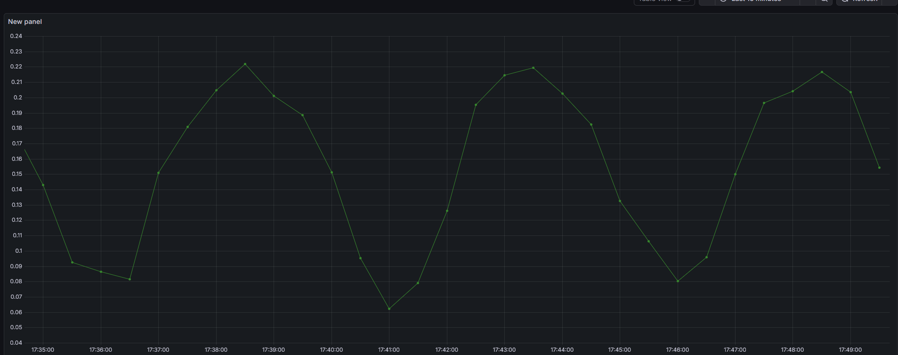
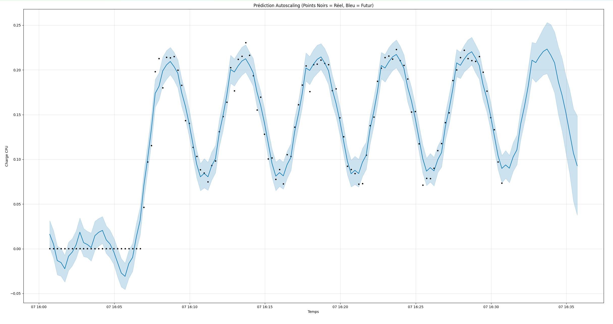
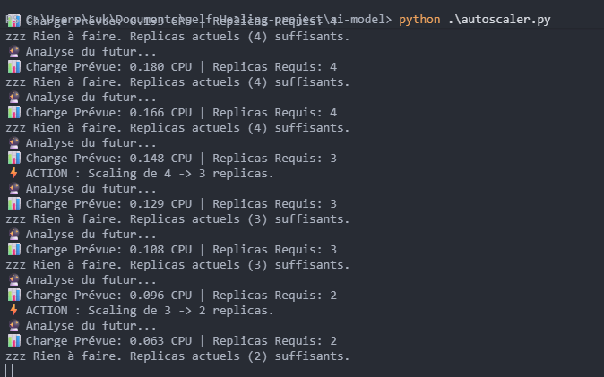

# 🔮 K8s-Prophet-Autoscaler : Infrastructure Auto-Réparatrice par IA


> **"L'autoscaling classique réagit à la douleur. L'autoscaling par IA l'empêche."**

## ⚡ Le Concept (AIOps)

Les Autoscalers Kubernetes standards sont **réactifs** : ils attendent que l'utilisation du CPU dépasse un seuil (ex: 80%) pour ajouter des répliques. Cela crée une période de latence où les utilisateurs subissent des lenteurs ou des erreurs 503 pendant le démarrage des nouveaux pods.

**Ce projet implémente un autoscaler PROACTIF.**
En utilisant le Machine Learning (Facebook Prophet) pour analyser les modèles de trafic en temps réel, le système prédit les pics de charge *avant* qu'ils ne surviennent et dimensionne l'infrastructure à l'avance.

**Résultat :** Scaling sans latence et optimisation des ressources.

---

## 📸 Démo


*Ici nous avons utilisé Grafana pour visualiser la consommation CPU de notre cluster K8s en temps réel.*


*Notre IA (Prophet) prédit en bleu la courbe que va prendre notre charge CPU, en se basant sur l'historique des points noirs (données réelles).*



*Le système prend des décisions autonomes : ici, il anticipe une baisse ou une hausse et ajuste le nombre de répliques (pods) instantanément.*

---

## 🏗️ Architecture Technique

```mermaid
graph TD
    User[Utilisateurs / Générateur de Trafic] -->|Requêtes HTTP| LB[Service K8s]
    LB --> Pods[Pods Applicatifs (Flask API)]
    
    subgraph "Couche d'Observabilité"
        Pods -->|Expose Métriques| Prom[Prometheus]
        Prom -->|Scraping toutes les 15s| AI[🧠 Autoscaler IA (Python)]
    end
    
    subgraph "Moteur de Décision"
        AI -->|1. Récup. Historique| Pandas[Traitement Data]
        Pandas -->|2. Entraînement Modèle| Prophet[Facebook Prophet]
        Prophet -->|3. Prédiction Futur| Forecast[Calcul de Charge]
        Forecast -->|4. Ordre de Scaling| K8sAPI[API Kubernetes]
    end
    
    K8sAPI -->|Scale Up/Down| Pods
```

### La Stack
* **App Cible :** Une API Flask conteneurisée conçue pour consommer du CPU (endpoint `/stress`).
* **Monitoring :** Prometheus (via Helm kube-prometheus-stack).
* **Le Cerveau :** Script Python utilisant :
    * `prometheus-api-client` pour l'ingestion de données.
    * `prophet` pour la prévision de séries temporelles.
    * `kubernetes` (client python) pour l'orchestration du cluster.

---

## 🚀 Fonctionnement (La Logique)

Le système fonctionne sur une boucle de rétroaction continue :

1.  **Ingestion :** Extrait les 30 dernières minutes de `container_cpu_usage` depuis Prometheus.
    * *Stratégie :* Utilise `sum(rate(...))` pour suivre la Charge Globale.
2.  **Entraînement :** Entraîne un modèle Prophet à la volée pour détecter les vagues.
3.  **Prédiction :** Estime la charge CPU totale requise pour la minute suivante.
4.  **Décision :** Calcule le nombre de répliques nécessaires.
    
    $$\text{Répliques} = \lceil \frac{\text{CPU Total Prédit}}{\text{CPU Cible par Pod}} \rceil$$

5.  **Action :** Applique directement le patch au Déploiement Kubernetes via l'API.

---

## 🛠️ Installation & Usage

### Pré-requis
* Docker & Minikube
* Python 3.10+
* Helm

### 1. Déployer l'Infrastructure
```bash
minikube start
eval $(minikube docker-env)
cd app-model
docker build -t fake-app:v1 ./app-fake
cd ..
kubectl apply -f k8s-fake.yaml
```

### 2. Installer le Monitoring
```bash
helm repo add prometheus-community https://prometheus-community.github.io/helm-charts
helm install monitoring prometheus-community/kube-prometheus-stack
kubectl port-forward svc/monitoring-kube-prometheus-prometheus 9090:9090
```

### 3. Activer l'Autoscaler IA
```bash
cd ai-model
pip install -r requirements.txt
python autoscaler.py
```